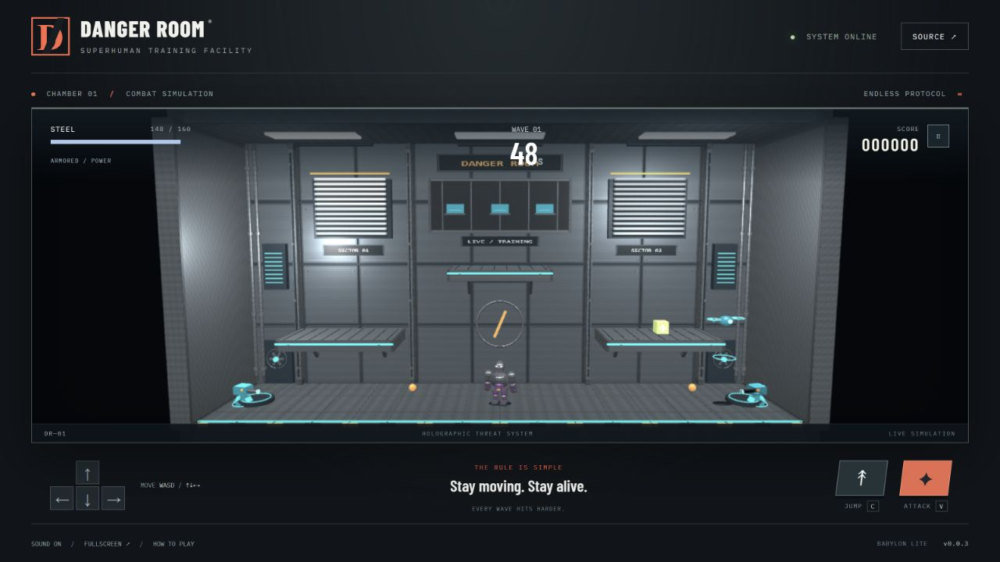

# Danger Room

One room. Sixty seconds. No final wave. An original single-player superhero training game with a 3D metal chamber, holographic enemies, and three distinct playable operatives.

[Play Danger Room](https://samuelasherrivello.github.io/babylon-lite-danger-room/) · [Releases](https://github.com/SamuelAsherRivello/babylon-lite-danger-room/releases)



## Play

- **The Spider** — web bullets slow enemies. Hold into either wall to cling; up/down climbs it.
- **Steel** — increased health and damage resistance. Tap attack to punch, attack in the air to kick, or hold attack to spread his arms and charge. Release for a horizontal shockwave; it fires automatically at three seconds.
- **Echo** — punch a hologram to steal its form for ten seconds. Drone head: hold jump to fly. Turret head: attack fires lasers, or punches an enemy within reach. Robot legs: jump higher. Each absorption replaces the previous power.

Survive 60 active seconds to clear a wave. Remaining threats dissolve, you earn 1,000 points and recover up to 20 health, and a five-second breather displays “Wave X in Y secs...” before the next wave starts. Pause also freezes this countdown. The opening wave gives you time to learn; later waves relentlessly increase pressure. Robots pursue, drones hover and fire, and turrets shoot aimed projectiles. Their health and damage grow without a final wave; simultaneous enemies are capped at 24. Pick up green health cubes or cyan shields. Personal best is saved on this browser.

The fixed 3D chamber uses original brushed-metal textures, structural pipes, recessed service bays, cast shadows, and articulated heroes and holograms. Ranged attacks follow your facing direction; hold up or down for diagonal shots.

| Action | Keyboard | Touch |
| --- | --- | --- |
| Move | A/D or left/right | Direction pad |
| Climb / aim | W/S or up/down | Up/down |
| Jump / fly | C (or Space) | Jump |
| Attack / charge | V | Attack |
| Drop through platform | S or down | Down |
| Pause / resume | P or Esc | Pause / Resume |

Touch actions work concurrently. Focus loss releases controls and pauses. Fullscreen, sound, instructions, restart and hero selection are available in the UI. Landscape orientation gives the largest useful view on phones.

## Run locally

Use Node.js 24+ and a WebGPU-capable browser with hardware acceleration. Serve from localhost or HTTPS. There is a clear recovery screen when WebGPU initialization fails; no WebGL fallback is included.

Run from the repository root:

```sh
npm ci
npm run dev
npm test
npm run format:check
npm run build
npm run preview
```

`npm run format` applies formatting. Vite uses `/babylon-lite-danger-room/` as its base for both development and GitHub Pages. The application stays in `project-name/`, as required by the repository guidance.

## Architecture and verification

- `project-name/src/game.js`: renderer-independent simulation, collision, enemy AI, abilities and wave scaling.
- `project-name/src/scene.js`: Babylon Lite WebGPU scene and original pooled 3D models.
- `project-name/src/App.jsx`: React menus, HUD, synthesized audio and keyboard/pointer lifecycle.
- `project-name/src/verification.js`: development-only browser fixture, activated by `?verify`. Tests use the actual keyboard/pointer event handlers; the full-wave bot uses normal health and damage. This module is eliminated from production builds.
- `project-name/test/`: gameplay, deployment-path and skill integrity tests.
- `openspec/`: design, tasks and accepted behavioral specifications.

See [verification evidence](project-name/documentation/verification.md), [original brief and asset provenance](project-name/documentation/brief.md), and [mobile screenshot](project-name/documentation/mobile-menu.png). Physical touch hardware has not been tested; the multi-pointer checks use emulated events. Browser rendering was inspected with real WebGPU.

## Release

`version.txt` is the single version source. Push main to deploy through `deploy-pages.yml`. Dispatch `release.yml` to install dependencies, test, build, increment the patch version, push a version commit/tag and create a GitHub release. Then explicitly dispatch `deploy-pages.yml`, because the release bot's push may not trigger another workflow. Verify the public game and displayed version, then `git pull --ff-only`.

The project was created from [SamuelAsherRivello/github-repository-template](https://github.com/SamuelAsherRivello/github-repository-template), with shared skills imported from [ai-skills-library](https://github.com/SamuelAsherRivello/ai-skills-library). Source revisions and retained instruction differences are recorded in the brief. The original MIT license is unchanged.

## Credits

<!-- AI: Preserve established attribution and ownership. Customize the following subsections only from confirmed contributor, contact, and license information; do not infer a new owner from the repository name. -->
### 💡 Contributors

<!-- AI: Preserve existing contributor credit and add contributors only when confirmed. Do not automatically advance experience counts or their reference year. -->
- Samuel Asher Rivello - Over 25 years of game development XP (2026)

### 💡 Contact

<!-- AI: Preserve confirmed contact destinations and their order unless requested otherwise. Use readable display URLs without a protocol or trailing slash while keeping the real link target intact. Do not invent accounts or change target capitalization based on display styling. -->
- [LinkedIn.com/in/SamuelAsherRivello](https://Linkedin.com/in/SamuelAsherRivello) ⭐ 
- [GitHub.com/SamuelAsherRivello](https://github.com/SamuelAsherRivello/)
- [Twitter.com/srivello](https://twitter.com/srivello/)
- Resume / Portfolio: [SamuelAsherRivello.com](http://www.SamuelAsherRivello.com)


### 💡 License

<!-- AI: Keep the license name linked to the actual relative license file and verify that its terms match this statement. Keep the copyright holder and year consistent with that file. Do not change license terms, ownership, or dates without an explicit request. -->
- Provided as-is under the [MIT License](LICENSE).

- Copyright © 2026 Rivello Multimedia Consulting, LLC.
